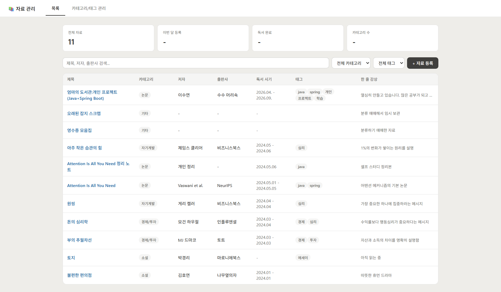
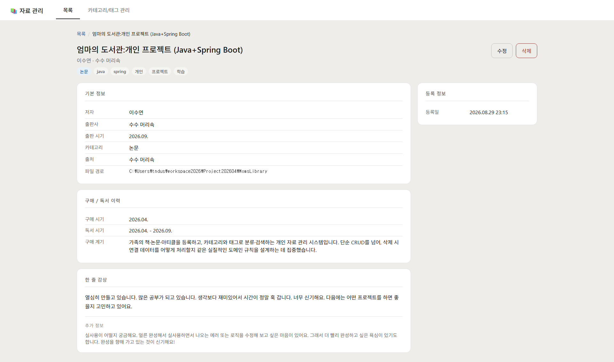
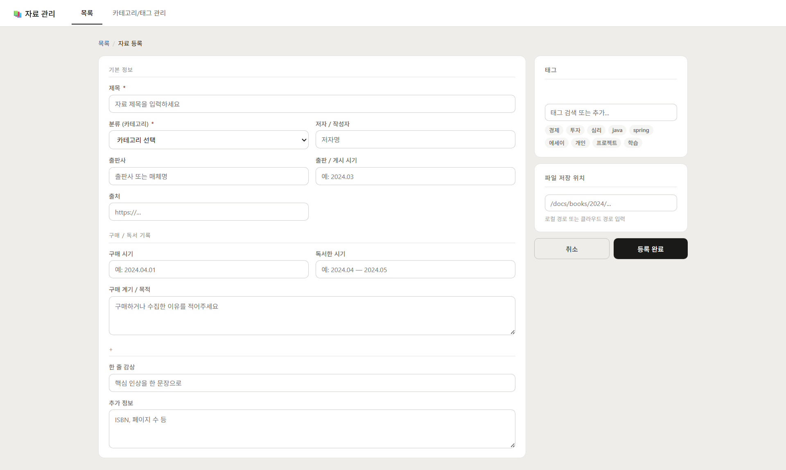
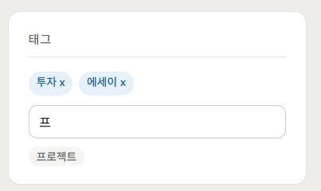
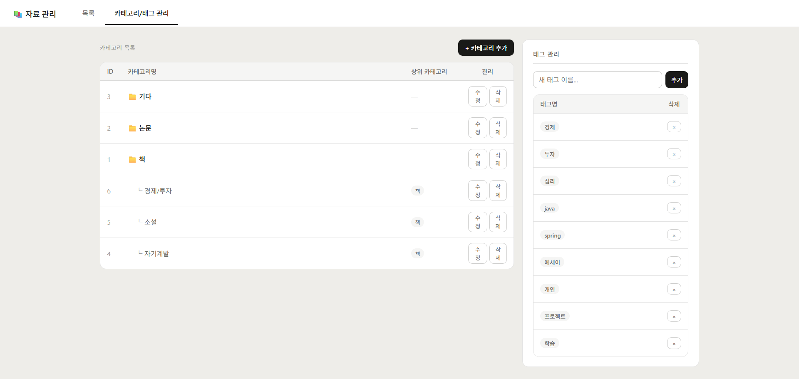
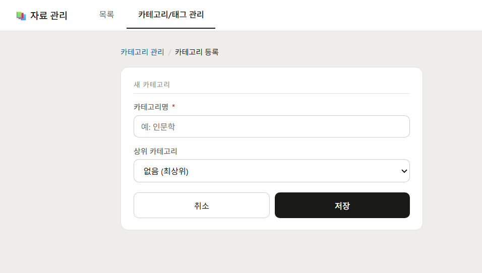
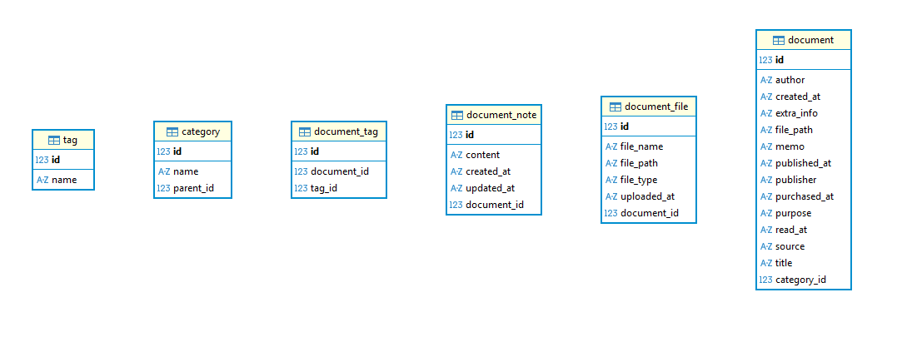

# 엄마의 도서관 (Mom's Library)

가족의 책·논문·아티클을 등록하고, 카테고리와 태그로 분류·검색하는 개인 자료 관리 시스템입니다.
단순 CRUD를 넘어, 삭제 시 연결 데이터를 어떻게 처리할지 같은 실질적인 도메인 규칙을 설계하는 데 집중했습니다.

---

## 화면
### 목록 화면


### 상세 화면


### 자료 등록 화면

태그 선택 및 검색


### 카테고리 관리 화면


### 카테고리 등록 화면


---

## 기술 스택

| 기술                              | 선택 이유 |
|---------------------------------|---|
| Java 21,<br> Spring Boot 3.5.14 | 학습한 스택을 실전 프로젝트에 적용 |
| Spring Data JPA                 | 객체 중심으로 1:N, N:M 관계를 다루는 방식을 익히기 위해 |
| SQLite                          | 별도 DB 서버 없이 파일 하나로 동작하는 개인용 도구에 적합 |
| Thymeleaf                       | Spring MVC 서버사이드 렌더링 방식을 익히기 위해 |
| JUnit5 + Mockito                | 테스트 가능한 코드 작성 연습 |

---

## ERD



Entity 설계 기준입니다. SQLite 특성상 실제 DB에서는 외래키 제약이 강제되지 않아,
DB 도구에서 조인 관계가 자동으로 표시되지는 않습니다.

---

## 핵심 설계 판단

| 항목                     | 판단 | 이유 |
|------------------------|---|---|
| 카테고리 삭제 <br>(하위 있음)    | 삭제 금지 (`CategoryHasChildrenException`) | 같은 이름의 하위 카테고리가 서로 다른 상위에 속할 수 있어, 상위 삭제 시 구조가 애매해짐 |
| 카테고리 삭제 <br>(연결 자료 있음) | "기타" 카테고리로 자동 이동 | 자료가 미분류로 남는 것보다 안전하게 이동 |
| 태그 삭제                  | 연결된 DocumentTag 선삭제 후 태그 삭제 | 참조 무결성 유지, 고아 데이터 방지 |
| 예외 처리                  | `@ControllerAdvice` 전역 처리 | 컨트롤러마다 try-catch 반복 방지 |
| Entity id              | setter 제거, DB 자동 생성값으로만 취급 | 애플리케이션 코드에서 실수로 id를 덮어쓰는 것 방지 |
| 컨트롤러 분리                | CategoryController / TagController | 화면은 공유해도 책임은 분리 |

---

## 테스트

JUnit5 + Mockito, 총 11개. <br>
작성 중 실제 버그 1건 발견·수정<br>
(`assignTags()`에서 파라미터로 받은 원본 리스트를 잘못 참조하던 문제).

---

## 실행 방법

```bash
./gradlew bootRun
```

실행 후 `http://localhost:8080/documents` 접속

---

## 진행 상황

### 완료
- **자료(Document)**<br>—등록/조회/수정/삭제<br>—목록·상세 화면에 카테고리·태그 표시
- **카테고리(Category)**<br>—등록/수정/삭제<br>—상위-하위 계층 구조<br>—삭제 시 하위 존재 여부에 따라 처리 분기
- **태그(Tag)**<br>—등록/삭제<br>—검색 UI<br>—자료 등록·수정 시 기존 선택 또는 신규 즉시 생성
- **예외 처리**<br>—도메인별 커스텀 예외<br>—`@ControllerAdvice` 전역 처리로 일관된 에러 응답
- **검증**<br>—서버단 필수값 검증(`@Valid`)으로 클라이언트 우회 방지
- **테스트**<br>—JUnit5 + Mockito 기반 서비스 레이어 단위 테스트 11개<br>—실제 버그 1건 발견·수정
### 진행 중 / 다듬는 중
- CSS 인라인 스타일 일부 정리
### Backlog (향후 개선 검토)
- 인증/보안 (Spring Security) — 개인 사용 환경 특성상 우선순위를 낮게 판단
- 자료 검색/필터 화면 연결
- 카테고리별 색상 지정 기능
- 페이지네이션 (현재는 전체 목록을 한 번에 표시, 자료가 많아지면 필요)
- 파일 위치 지정 및 연결 기능 (`DocumentFile`)
- 메모 기능 (`DocumentNote`)
- 카테고리/태그 삭제 시 "몇 개 자료에 영향을 주는지" 사전 안내
- 통계성 지표(전체 자료 수, 이번 달 등록 수 등) 실데이터 연동
- 개발 과정에서 사용한 임시 코드(`exampleAi.html`, `HelloController.java`) 정리

## 더 알아보기
프로젝트 기획서, 요구사항정의서, API 명세서는 [여기](https://docs.google.com/document/d/17O8gQo8s_dOWljrMNcY6LJgyJjCbHhaipbY6GlPkKAM/edit?usp=sharing)에서 확인할 수 있습니다.

